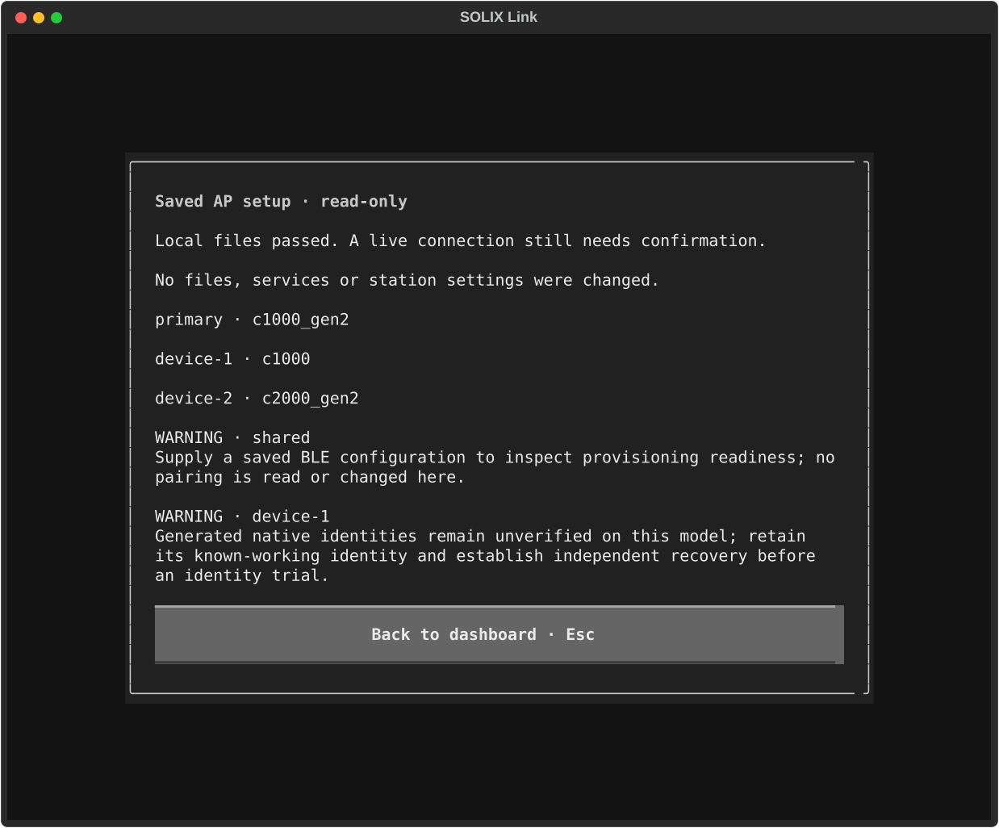
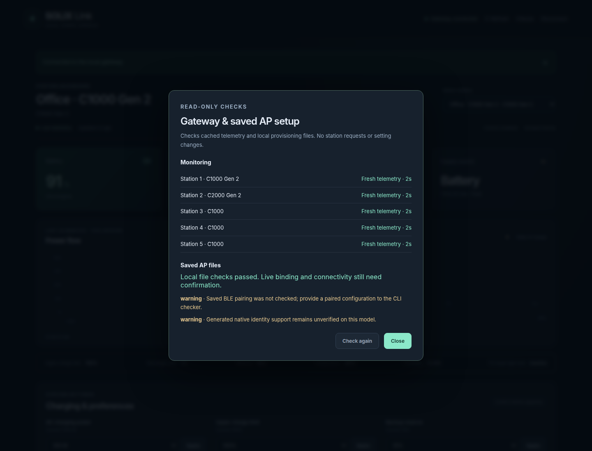

# Check saved AP setup before provisioning

The read-only checker helps diagnose local configuration problems without
starting the AP, contacting stations, repairing files or changing identities:

```sh
solix-link ap-service-check --directory /path/to/private/shared-ap \
  --config /path/to/private/paired-devices.json
```

`--config` is optional. Without it, saved BLE pairing cannot be checked and the
report contains a warning. Exit **0** means no local-file errors; exit **1**
means errors were found. Warnings still require review before provisioning.

## Available interfaces

- **Terminal dashboard:** pass `--ap-service-directory`, then press **F8** or
  choose **Check saved AP setup** in Events. The scrollable report uses ordinal
  profile labels and leaves monitoring connected.
- **Line menu:** choose MQTT connection → Check saved AP setup.
- **Browser dashboard:** choose **Checks** to view cached monitoring diagnostics
  and saved AP findings without changing the selected station or settings drafts.
- **HTTP:** authenticated GET/HEAD `/setup-check` on the native AP gateway.
  The Bluetooth-only gateway returns 404. HTTP has no saved-BLE configuration
  input, so that optional check remains unavailable.
- **Python:** `check_ap_service(directory, paired_config=None)` in
  `solix_link.ap_service_check`; the native monitor also exposes
  `await monitor.check_setup()`.

## What is checked

The checker inspects owner-only regular files and directories, bounded JSON/PEM
inputs, profile schemas, shared network settings and unique routing identities.
It verifies certificate validity, signatures, roles, server address coverage,
matching keys, distinct client certificates, and consistency between encrypted
MQTT credential responses and the saved credentials. Optional BLE configuration
is checked for a matching model and retained Prime pairing identity.

Reports contain fixed findings and profile labels, not paths, station names,
IDs, Wi-Fi passwords, certificate contents or raw errors. HTTP responses are
uncached and use the gateway's existing authentication.

**Passing checks does not establish live binding, radio connectivity, identity
origin or working hardware.** Generated native identities remain unverified
on original C1000 and C2000; C1000 Gen 2 evidence is limited to main 1.1.4.9 /
radio 0.3.3.0. An independent recovery path is required before changing an
identity used by HA. The checker sends no provisioning or control command.




