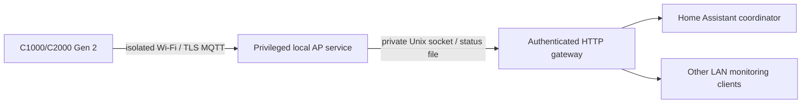

# Local gateway and Home Assistant

## Deployment layout

Run one station connection owner and let other machines use its HTTP API:



For BLE models, `serve` owns Bluetooth instead of `ap-service-run`/`ap-service-serve`. Do not
start both BLE owners for the same station. The separate gateway keeps AP
privileges and reconnection out of HA; HA uses one shared HTTP client/coordinator
as described in its [official fetching guidance](https://developers.home-assistant.io/docs/integration_fetching_data/).

## Start the native gateway

Install into a venv and complete [isolated AP setup](isolated-ap-mqtt.md).
Use absolute private directory paths and a dedicated unused AP adapter.

```sh
python3 -m pip install -e './python[server,mqtt,tui]'
sudo /path/to/venv/bin/solix-link ap-service-run \
  --directory /path/to/.solix-private/local-mqtt --allow-control
```

In another shell, load a generated token from an owner-only file:

```sh
export SOLIX_HTTP_TOKEN="$(cat /path/to/private/http-token)"
sudo --preserve-env=SOLIX_HTTP_TOKEN /path/to/venv/bin/solix-link ap-service-serve \
  --directory /path/to/.solix-private/local-mqtt \
  --host YOUR_LAN_ADDRESS --port 8765 --allow-control
```

The default bind is localhost. Both worker and HTTP gateway must explicitly
enable controls. HTTP control startup refuses an empty token. Every API endpoint
requires the token when configured. Add `--web-ui` for the optional
[Vue dashboard](web-dashboard.md); its public shell contains no station data.
The gateway uses FastAPI/Uvicorn and bundles its UI assets with Python. Protect the LAN connection or place a
trusted HTTPS proxy in front of it; the station remains in its isolated network.
For BLE, use `solix-link serve --config ... --allow-control` with the same token.

## Command API

GET `/devices` returns stations, freshness, `power_flow`, metrics and the
available `controls` and configured `timezone_name`.
A [shared AP](multiple-ap-devices.md) exposes each registered station through
these same endpoints. POST `/devices/{saved-name}/commands` accepts only the
advertised command schema. For example:

```json
{"command": "return-grid", "timeout": 30}
```

Send `Authorization: Bearer <token>` and `Content-Type: application/json`.
Other native commands: `set-charge-power`/`watts`, `set-charge-cap`/`upper`,
`set-backup-reserve`/`reserve`, and `set-tou-plan`/`periods`/`enabled`.
C1000 Gen 2 native profiles additionally advertise `set-temperature-unit`
with boolean `fahrenheit`, `set-off-grid-alert` with boolean `enabled`, and
`set-discharge-floor` with integer `lower` (1,5,10,15,20, within reserve bounds).
Temperature and alert settings were [checked live](c1000-general-settings.md),
as was the [guarded lower discharge limit](c1000-charging-control-followup.md).
Each period has `tariff`, `start_hour`, `end_hour`. Fields/types are strict;
no arbitrary opcode, AC-output, timer or firmware command is exposed.

Success returns an updated station snapshot. Bad requests return 400, disabled
or unsupported commands 403, unavailable/failed confirmation 409, timeout 504.
Errors include `settings_may_have_changed`; inspect fresh telemetry before
retrying. Status endpoints omit serials, pairing IDs and raw packets.

## Home Assistant setup

Copy [the custom integration](../custom_components/solix_link/README.md) into
HA's `custom_components/solix_link`, restart, and add **SOLIX Link** through
Settings → Devices & services. Enter the gateway URL and token. It prepares
capability-gated sensors, charging numbers, Return-to-grid and a TOU-plan action.
Polling is every five seconds when idle; polling waits behind a command.

The component is prepared and contract-tested, **not installed on the user's
HA node or verified in a running HA instance**. Follow its runtime/hassfest
checklist before depending on automations. HTTP/SSE/Prometheus remain available
to clients independently of HA.

## Persistent settings

An activated plan remains on the station until changed. Closing the TUI,
stopping the AP, ending a process or canceling an HTTP request does not reset
the station. Use `ap-service-grid` or HA's Return-to-grid button and check its confirmed
flow before stopping a discharge plan. Grid confirmation needs a measurable
positive AC load; zero-load readings are insufficient.

C2000 all-day Peak and tariff-3 return are tested live. C1000 also has a
[reconnect, two-slot selection and reserve-at-SOC test](c1000-local-mqtt.md),
but actual timed transitions and discharge down to a reserve floor remain unverified. The gateway issues no automatic tariff policy; callers choose
when to charge/discharge and must handle disconnects and stale observations.
