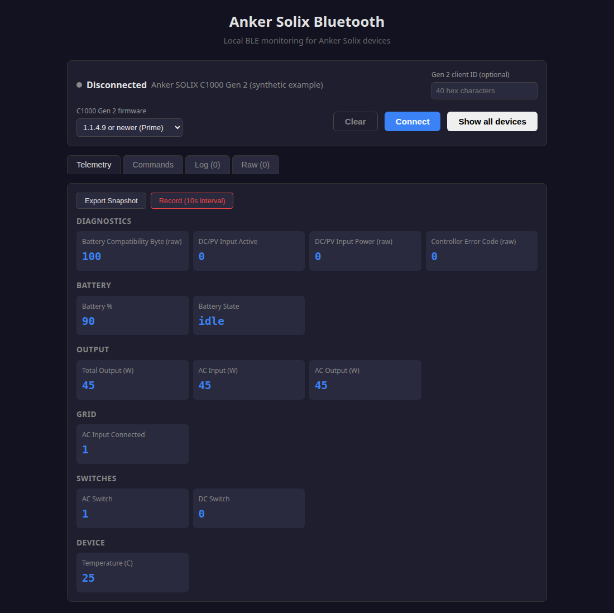

# Additional Gen 2 telemetry: PV input, temperature and error state

## Scope and evidence

This investigation executes **C1000 Gen 2 (A1763), main 1.1.4.9** controller instructions against synthetic RAM. It adds **147 offline cases** using the published, hash-checked firmware. No device connection, setting change, fault induction or external request was performed. It does not establish these meanings for original C1000 (A1761), C2000 or other firmware.

The findings provide useful read-only telemetry candidates and correct a misleading interpretation of the existing battery-health byte. They do not identify a new charging or bypass control.

## Complete telemetry structures

Offsets below include the leading `04` type byte and refer to the TLV value, excluding its tag and length. Registration entries and actual serializers agree on these shapes:

| Tag | Complete length | Field | Evidence |
| --- | ---: | --- | --- |
| A3 | 14 | Byte 2: current controller error code | Registration `08032d88`, builder `0801a2a8` |
| A5 | 6 | Byte 1: signed selected battery temperature; byte 3: SOC; byte 4: fixed 100 | Registration `08032da0`, builder `08019798` |
| A6 | 10 | Bytes 3–4: AC input; bytes 5–6: PV/DC input, little-endian unsigned words | Registration `08032dac`, builder `0801a9f4` |
| A8 | 4 | Byte 1: PV/DC input state; bytes 2–3: PV/DC input power word | Registration `08032dc4`, builder `08019e90` |

Gate new interpretations on the C1000 Gen 2 model, complete known structure and type `04`; only interpret A8's state byte as a boolean when it is 0 or 1. Preserve unrecognized raw fields without inventing an interpretation. These are ordinary status fields, so a new diagnostic command is unnecessary.

## The reported health byte is not measured state of health

A5's builder calls sensor kind 27 at `08019824..0801982a`. Its getter branch at `08018524` returns the literal **100**; it does not read BMS state. All 84 battery cases retain A5[4] = 100 while changing synthetic BMS fill, SOC, temperature distribution and aggregate power inputs.

For this model and firmware, displaying this byte as measured battery health or degradation is unsupported. Suppress that interpretation or retain the value only as a documented raw compatibility field. This finding does not show that the battery is healthy, and does not settle whether a different message carries a real health estimate.

### Temperature selects an extreme

The same builder first obtains the integer mean of four battery temperature values. At a mean **above 25°C**, it reports their maximum; at **25°C or below**, it reports their minimum (`080197d8..080197f4`). Examples from actual getter and serializer execution:

| Synthetic sensor values, °C | Integer mean | Reported A5 temperature |
| --- | ---: | ---: |
| 0, 10, 20, 30 | 15 | 0 |
| 20, 30, 40, 50 | 35 | 50 |
| 10, 20, 30, 40 | 25 | 10 |
| 11, 20, 30, 40 | 25 | 11 |
| −20, −10, 0, 10 | −5 | −20 |

The getter reads four words at `2000403f..20004045`, subtracts 2731 and divides by 10 with signed truncation. The mean uses the sum shifted right by two before that conversion. This is a selected battery-temperature summary, not an average; switching which extreme is selected can cause a reported jump. Physical sensor location and calibration were not established.

## PV/DC input telemetry

The A8 builder names its data `pvData`. Its state getter, `0801a518(8)` → `08019444`, returns bit 0 of `20000164`. The power getter, `0801a724(6)`, reads the input-power table at `200021a4`. A6[5:7] reads the same entry; AC input remains a separate entry at A6[3:5].

In 24 full serializer cases, PV values 0, 1, 6, 123, 600 and 65535 were varied independently of AC input and the PV state bit. **A8[2:4] always matched A6[5:7]**, and changing AC input did not change either PV field. Values near the unsigned-word limit are synthetic boundary tests, not credible operating power.

This supports a separate **DC/PV input power** sensor. Its watt scale is inferred from the shared input-power table and existing AC power representation; it still needs a passive nonzero-panel sample for physical verification. Call the boolean **DC input active** rather than promising plug detection: the physical producer, low-light behavior and inactive-but-connected case were not exercised. A zero power reading and an active bit can coexist in the serializer; avoid forcing one from the other.

### Producer and freshness limits

Static inspection of the MPPT routine at `08025140` provides a further lead. It reads a signed module word at `20003f5c`, clamps negative values to zero, and conditionally writes input slot 6 (`08025314..08025348`). One BMS flag imposes a minimum of 6; another clears the power value. An inactive branch also clears that slot. Those flags' physical meanings and the complete MPPT producer were not replayed, so the displayed word should not be described as an unfiltered ADC reading.

A8's internal serializer update mode 3 refreshes only the state byte and **retains the previous buffer's power word**. Six additional cases put 999 in the current power RAM while retaining prior values 0, 123 or 600 in the serialized field. This internal mode is not an exposed packet flag. A recent message alone does not prove that every enclosed field was freshly sampled. Prefer a complete status request and compare the two PV representations when validating a new decoder.

## Raw controller error code

A3[2] comes from `080181cc(0)`, which returns the current byte at `200000c0`. Its setter, `08007030`, logs an `ERROR` message and preserves a different previous code at the next byte; the A3 field exposes only the current code.

The 33 cases execute the actual setter and serializer with varied previous and new values. Duplicate codes inside 1000 synthetic tick units are suppressed; the same code at the boundary is accepted. These test values do not constitute a valid enum or establish the tick unit as milliseconds. Timer-service calls are substituted.

For a static producer example, the MPPT routine tests module flags at `20003f4e`: masks `0307` and `6c10` feed codes 1 and 2 respectively (`080253ca..080253ea`). This does not justify naming individual faults. Other producers share the same current-code storage, so zero is not proof that every module is fault-free.

A conservative integration can expose **controller error code** as a raw diagnostic integer. Do not infer named alarms or offer a clear-error command from this finding. Passive baseline collection is sufficient for an initial decoder check; no fault needs to be induced.

## Reproduction and limits

The Python and Web Bluetooth decoders now expose C1000-only `dc_input_active`,
`dc_input_power_raw` from complete A6, and `controller_error_code`. HA offers
these as disabled-by-default diagnostics, with no unverified power units or
energy statistics. Packed Gen 2 health is renamed `battery_health_raw`; the
original C1000 scalar health field is unaffected. The C2000 byte retains raw
labelling without claiming this A1763 constant getter applies there.

A passive C1000 Gen 2 baseline on 2026-09-30 confirmed type04 block lengths
A3=14, A5=6, A6=10, A8=4 and decoded active=0, power=0, error=0,
compatibility byte=100 (main 1.1.4.9 / radio 0.3.3.0). This verifies layout at
zero input; it does not calibrate PV units or confirm panel detection. These
samples are retained with the private [timeout trial](device-timeout-behavior.md).



The standalone [additional-feature replay](../tools/firmware_analysis/emulate_additional_features.py) uses the existing [offline dependencies and firmware input rules](firmware-analysis-reproduction.md):

```sh
SOLIX_ANALYSIS_OUTPUT=/tmp/solix-additional-replays \
  python3 tools/firmware_analysis/emulate_additional_features.py
cmp /tmp/solix-additional-replays/additional-features-results.json \
  tools/firmware_analysis/expected_results/additional-features-results.json
```

Expected groups: **84 battery/temperature, 24 full PV, 6 incremental PV, 33 error-code cases**. The new synthetic result and manifest files are independent of the existing combined replay manifest. Tested with Python 3.12.3 and Unicorn 2.1.4. Input `MainMcu-decoded.bin` has SHA-256 `21ffb746c1e07ecaa9817fa7017807585a00bedbca3f136c650129bb52a4a0c9`.

Actual sensor/power/state getters, field serializers and the error setter execute. Memory copy/clear, logging, system ticks and error-report timer services are substituted. BMS/DSP reception, ADC sampling, physical input detection, real fault producers and app presentation do not execute. Synthetic RAM combinations deliberately test independent fields and may not represent stable physical states. Published results contain only firmware observations and synthetic inputs, with no captured identifiers, credentials or phone data.

The next useful device check is read-only: collect complete C1000 status while a suitable PV source is already operating, compare A6 and A8, and compare power with the app or a meter. A zero-input baseline can verify layout but cannot validate units or the physical meaning of the state bit. Original C1000 discharge behavior remains a separate investigation; none of these A1763 findings establish an A1761 control.
