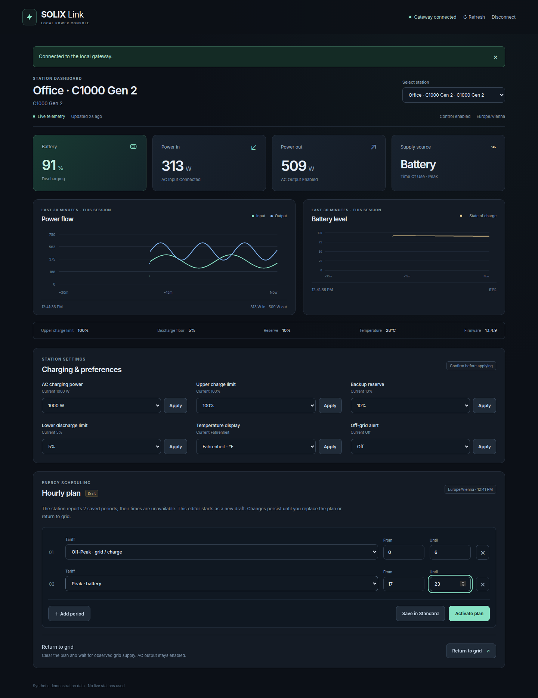

# Local web dashboard

The optional **Vue 3** dashboard is served by the **FastAPI/Uvicorn** gateway.
The Python package includes the compiled HTML, JavaScript and CSS: deployment
needs no Node installation, CDN or internet access. The original Web Bluetooth
app in `src/` remains a separate application.

## Run

```sh
python3 -m pip install './python[server,mqtt]'
# Load a generated token from your owner-only configuration.
export SOLIX_HTTP_TOKEN="$(cat /path/to/private/http-token)"
solix-link serve --config /path/to/config.json --web-ui --allow-control
```

For a station already connected to the isolated native MQTT service:

```sh
solix-link ap-service-serve --directory /path/to/private/ap-service \
  --web-ui --allow-control --host YOUR_LAN_ADDRESS --port 8765
```

The native worker must also have `--allow-control`. Without that flag, or
without gateway `--allow-control`, the dashboard is read-only. Writable gateway
startup requires a nonempty token. Open the gateway's `/` URL, enter the token,
and connect. An unprotected read-only gateway accepts an empty token.

The default bind is `127.0.0.1`. Use a trusted HTTPS reverse proxy when serving
beyond localhost. The station's isolated network and the gateway's LAN listener
are separate; serving this dashboard does not give the station internet access.

## Monitoring and controls

Select a station to see battery, input/output power, supply state, freshness
and session history. The browser polls cached gateway status every five seconds;
it does not open another station connection. History stays in browser memory,
is bounded to 30 minutes, and resets on reload. Missing or stale samples produce
chart gaps rather than invented readings. This is not durable energy accounting.

Controls follow the selected station's advertised capabilities. Each change
requires a review and explicit confirmation; offline or busy controls are
disabled. Charging settings and draft hourly tariff plans use the same strict
command API as the CLI and Home Assistant. Native C1000 Gen 2 also exposes
[verified temperature and off-grid alert settings](c1000-general-settings.md).
C1000 Gen 2 also has a guarded lower discharge limit; it cannot silently
adjust reserve. There is no HTTP AC-output switch. Several native stations can
share one AP: see [registration and selection](multiple-ap-devices.md).

A tariff editor is a **draft**, not a copy of the station's active schedule.
Only its active mode, tariff and slot count are available in the status API.
Saving replaces the entire plan; activation persists on the station even after
closing the browser. Check the configured station timezone before choosing
hours. Return to grid requests confirmation from measured telemetry; it is not
an AC-output off command. A timeout can leave changed settings: inspect fresh
status before deciding whether to retry. The UI never retries a write.

## Authentication and API

The bundled shell and its exact asset paths are public and contain no station
telemetry. `/health`, `/devices`, `/events`, `/metrics` and command routes still
require the configured Bearer token. The browser keeps the token only in memory,
clears its input after connecting, and forgets it on disconnect or authentication
failure. It uses no local storage, cookies or token query parameters.

Existing JSON routes, SSE events, Prometheus metric names and the prepared HA
integration retain their contracts. The server implementation now uses FastAPI;
reinstall the `server` extra after upgrading from an older aiohttp-based build.
No Swagger/CDN routes are enabled. See [deployment and schemas](gateway-home-assistant.md).

## Develop

```sh
npm ci
npm run dev:dashboard    # Vite; proxies API requests to localhost:8765
npm run build:dashboard  # Vue type check, then bundled Python assets
PYTHONPATH=python python3 -m pytest python/tests home_assistant_tests -q
```

Install `pytest`, `httpx` and `aiohttp` to include gateway and standalone HA
contract tests. Vue sources live in `dashboard/`; commit both sources and the
built `python/solix_link/web/` assets after UI changes. `npm run build` still
checks the original Bluetooth application.

## Browser checks and screenshots

```sh
python3 -m pip install './python[server]'
npx playwright install chromium
npm run build:dashboard
npm run test:dashboard
```

For another interpreter/browser use `SOLIX_TEST_PYTHON=/path/to/python` and
`SOLIX_CHROMIUM_PATH=/path/to/chromium`. The checks start their own ephemeral
localhost fixture and use only simulated stations. They cover authentication,
write confirmation/cancellation, model capabilities, unsaved drafts, read-only
and stale states, command failure, disconnect races and mobile layout. They
cannot send a command to a real station. Screenshots are regenerated from
synthetic data:



[Mobile screenshot](images/web-dashboard-mobile.png).
