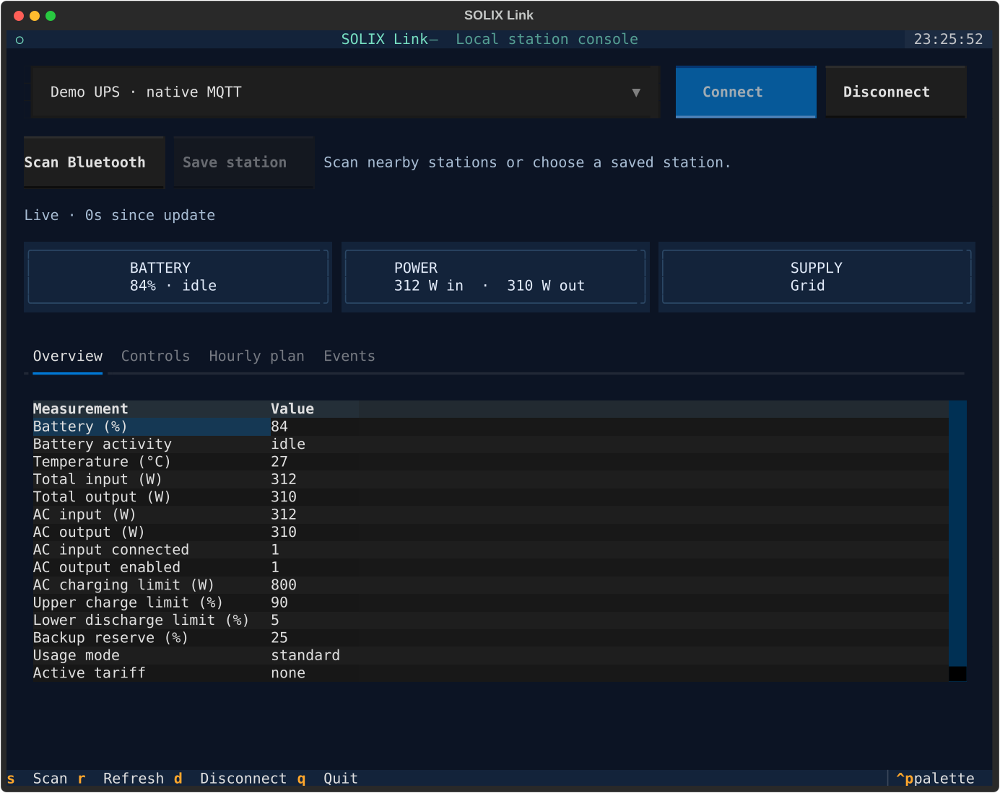

# solix-link

Async Python monitoring over local Bluetooth, with a CLI, HTTP server, and
MQTT bridge. It uses no cloud account.

An experimental **isolated Wi-Fi/native MQTT endpoint** is also available for
C1000/C2000 Gen 2: `ap-service-init`, `ap-service-run`, `ap-service-status`, `ap-service-readiness`,
`ap-service-set-charge-power`, `ap-service-set-charge-cap`, `ap-service-set-reserve`, `ap-service-set-tou`,
`ap-service-grid` and `ap-service-serve`. It packages the
local API, NTP and mTLS interception workflow, without an internet route.
One [shared AP](../docs/multiple-ap-devices.md) supports multiple registered
Gen 2 stations with terminal/browser/API selection.
C1000 uses its generated BLE pairing ID for local MQTT; C2000 generated-ID
MQTT remains unverified. See [C1000 findings](../docs/c1000-local-mqtt.md).
Monitoring is the default;
native charging writes require `--allow-control` and fresh confirmation.
See [setup, Python exports and limitations](../docs/isolated-ap-mqtt.md).

Run `solix-link` without arguments with the `tui` extra for a full-screen
terminal dashboard with fixed connection/status rows, selectable panels,
asynchronous scanning, live measurements and explicit controls. Without that
extra it uses the line menu and shows an installation hint. `solix-link
interactive` retains guided pairing, AP setup and service launching. Commands
such as `monitor`, `serve` and `ap-service-status` keep their scripted behavior.

| Model profile | Monitoring | Controls |
| --- | --- | --- |
| `c300` — C300/C300X AC | C300X tested live; C300 sibling uses the reference map | AC output, light, charging-power limit, screen timeout verified |
| `c1000` — original A1761 | Live monitoring and restored control cycles, version code 151 | Charging/output/light/display/device timeout, temperature units, fast charge and AC/DC Smart modes; no direct local MQTT yet |
| `c1000_gen2` — A1763 | BLE and native MQTT tested live | Charge limits/power, display/device timeout, fast charge; native reserve, tariffs/grid return, temperature, alert and guarded discharge floor |
| `c2000_gen2` — A1783 | Tested live | Upper charge cap, charging power, screen timeout; native reserve, all-day Peak and confirmed grid return |

C300 DC variants are not supported. The distribution and CLI are `solix-link`;
the Python import is `solix_link`. Existing `solix-gen2` commands and
`solix_gen2` imports remain compatibility aliases to the same implementation.
The config path `~/.config/solix-gen2/config.json`, MQTT topic prefix
`solix_gen2` and Prometheus metric names remain stable, so existing deployments
can upgrade without moving their saved pairing IDs or changing dashboards.

Install from this repository (include `server` and/or `mqtt` for the network services):

```bash
pip install './python[server,mqtt,tui]'
```

AP-service Python APIs use `APServiceConfig`, `APService` and
`ap_service_request`; configuration is `ap_service.json`. Add
`ap-service-run --energy-reports` for optional local analytics capture. The
counter units remain unverified; no HA energy statistics are derived from them.

## Terminal dashboard and HA gateway

```sh
solix-link tui --config /path/to/config.json
solix-link tui --ap-service-directory /path/to/.solix-private/local-mqtt
```



Connection, status and summaries stay visible while the selected panel scrolls.
Live updates preserve the readings table's selection and scroll position.
Smaller terminals use a compact summary and scrollable forms. Use the mouse or
keyboard:

| Key | Action |
| --- | --- |
| Tab / Shift+Tab | Move between fields and buttons |
| Up / Down, Enter | Choose a station, setting or option |
| F1 / F2 / F3 / F4 | Overview / Controls / Hourly plan / Events |
| Ctrl+O / Ctrl+D | Connect / disconnect monitoring |
| Ctrl+S / Ctrl+R | Scan / request fresh readings |
| ? / F10 | Keyboard and workflow guide; Esc closes it |
| Ctrl+Q / Ctrl+C | Quit after the current operation finishes |

The `tui` dependency is optional. For a pipx installation from this checkout,
use `pipx install --force './python[server,mqtt,tui]'`; ordinary pip users can
add it with `python -m pip install './python[tui]'`. `solix-link interactive`
always opens the line-based guide, even when the dashboard is installed.

Scan merges nearby stations without changing saved configuration; Save station
appends a selected device. C300/original C1000 connect without an account ID.
For unpaired Prime stations, follow `pair`/`interactive` main-button instructions
first. The dashboard opens disconnected and connects only on request. Native
MQTT selection uses an already-running AP-service worker; it does not create an AP.
Controls honor model/worker permissions, and C2000 has no AC-output switch.

Device Timeout is available for the two C1000 profiles:
`solix-link set-device-timeout --name c1000-original --minutes 0` or
`ap-service-set-device-timeout --directory /path/to/private-ap --minutes 0`.
Zero means Never; finite choices are 30/60/120/240/360/720/1440 minutes.
BLE fresh readback passed on both models; native MQTT timeout has synthetic
tests only. Never disables this configured timeout, not every sleep path or
already queued event. See [timeout behavior](../docs/device-timeout-behavior.md).

Gen 2 `battery_health_raw` replaces the misleading packed `battery_health`:
A1763/main 1.1.4.9 emits literal 100. New C1000 Gen 2 raw diagnostics are
`dc_input_active`, `dc_input_power_raw` and `controller_error_code`; PV units
and named fault meanings are unverified. See [firmware findings](../docs/gen2-additional-feature-investigation.md).
Closing the dashboard disconnects monitoring; it does not restore settings.

C1000 Gen 2 A4[18] is now correctly named `display_brightness` (previously
`display_mode`). The existing `display_enabled` field describes runtime
display-timer activity, not saved configuration; fast charge can wake it.

Original C1000 temperature, fast charge and AC/DC Smart preferences are
[physically verified](../docs/c1000-preferences-validation.md) and exposed in
the terminal/browser/CLI, bridge and gateway/HA. Boolean commands are
`set-temperature-unit` (`fahrenheit`), `set-fast-charge`,
`set-ac-power-saving` and `set-dc-power-saving` (`enabled`). Smart may
automatically stop an output at low load; enabling it is a persistent setting.
The original model uses command 0=Normal/1=Smart and status 1=Normal/2=Smart.

For multiple clients, run one [authenticated HTTP gateway](../docs/gateway-home-assistant.md)
with optional controls. The [prepared Home Assistant custom integration](../custom_components/solix_link/README.md)
adds UI setup, shared-coordinator sensors, charging numbers, Return-to-grid
and a TOU-plan action. It has contract tests; HA runtime installation remains
unverified. Native Wi-Fi services run separately from HA with no internet route.

Pair a Prime station once as described below, then find a nearby unit and
print updates using its saved client ID:

```python
import asyncio
import os
from solix_link import SolixMonitor, discover

async def main():
    devices = await discover()
    if not devices:
        raise RuntimeError("No supported SOLIX device is advertising")
    async with SolixMonitor(devices[0], owner_user_id=os.environ["SOLIX_CLIENT_ID"]) as monitor:
        while True:
            print(await monitor.wait_for_update(timeout=30))

asyncio.run(main())
```

For a Home Assistant integration, reuse the discovered `BLEDevice` and register
an update callback:

```python
monitor = SolixMonitor(
    ble_device,
    owner_user_id=saved_client_id,
    on_update=lambda metrics: coordinator.async_set_updated_data(metrics),
)
await monitor.connect()
# On unload: await monitor.disconnect()
```

### C300/C300X AC and original C1000

These profiles automatically select legacy Bluetooth and do not need
`owner_user_id` or `pair`. For example:

```bash
solix-link scan
solix-link add --name c300 --model c300 --address AA:BB:CC:DD:EE:03
solix-link monitor --name c300
solix-link set-display-timeout --name c300 --seconds 60
solix-link set-display-timeout --name c300 --seconds 30
solix-link set-ac-output --name c300 --enabled on
solix-link set-light --name c300 --mode low
solix-link set-charge-power --name c300 --watts 300
```

Use `SolixMonitor(ble_device)` or, with an address,
`SolixMonitor(address, model=Model.C300)` in Python. The same saved config works
with `serve` and `mqtt-bridge`; the bridge accepts C300 `display_timeout`,
`ac_charging_power`, `ac_output`, and `light_mode` commands and publishes
telemetry. C300 AC off/on, light off/low, 330/300 W limit, and 30/60 s display
timeout were tested with each baseline restored. Charging-power choices are
100/200/300/330 W; light modes are off/low/medium/high (0–3). The other values
follow the reference map. The power test confirmed the stored AC limit while
USB-C supplied charging; it did not measure AC charging-rate enforcement.
No battery-percentage cap or reliable mains-presence field is identified.
See [C300 findings](../docs/c300-protocol.md).

Original C1000 uses `--model c1000` / `Model.C1000`. Live monitoring and restored
display, timeout, brightness, light, charging-power and AC/DC control cycles
passed on A1761 version code 151. Controls
are available without an opt-in flag: use the standard power/display/AC/light
methods and CLI commands, or `monitor.set_c1000_setting("display_brightness", 2)`
and `c1000-setting` for additional settings. The bridge accepts the same four
operations as C300. Device rejection replies raise errors; success requires
the requested fields to appear in fresh telemetry after the write. Cached
readings or an acknowledgement alone cannot confirm a setting. A timeout
can still mean the setting changed; inspect before retrying.
Charging power and restoration also passed through the HTTP gateway on both
C1000 generations. These full-battery checks confirm stored limits, not physical
charging-rate enforcement. Remaining runtime is explicitly unknown for oversized
values and `ffff`; zero AC input power does not establish missing mains.
See [original C1000 support](../docs/c1000-original-protocol.md) and
[chain validation](../docs/c1000-chain-validation.md) for tested values and uncertainty.
Original C1000 `wifi-join` / `wifi-setup --country-code AT` also join an isolated
WPA2 AP and replace the radio API endpoint. The CLI privately saves a generated
local provisioning ID when needed. See [the network trial](../docs/c1000-original-wifi-validation.md).
The original C1000 can use the BLE-to-MQTT bridge; its own direct local MQTT
provisioning and connection remain unverified.

### Gen 2 telemetry and diagnostics

`monitor.metrics` contains the latest decoded values. `monitor.raw_tlvs` keeps
the original parameter bytes for further model decoding. C1000 Gen 2 metric
offsets follow the [SolixBLE C1000G2 implementation](https://github.com/flip-dots/SolixBLE/blob/main/SolixBLE/devices/c1000g2.py).

For Wi-Fi/MQTT troubleshooting, query radio diagnostics on an existing Prime
connection with `await monitor.network_diagnostics()`, or run:

```bash
solix-link network-diagnostics --name ups
```

The result contains `http_error_code`, `wifi_error_code`, `ble_disconnect_code`,
`mqtt_error_code`, `system_reboot_code`, and `sdk_reset_code`. This query was
tested on C2000 main 2.1.6.4 and C1000 main 1.1.4.9/radio 0.3.3.0.
It changes no power/network settings.
Preserve the first result: reset codes may become 255 on later reads. Zero
errors do **not** prove a connection, and these are not battery/inverter faults.
Run it separately from Wi-Fi provisioning, which shares the response queue.
See [native MQTT findings](../docs/local-mqtt-investigation.md).

For UPS monitoring, `ac_input_connected` is 1 while the mains lead is present
and 0 when it is absent, even if AC output remains on. `battery_status` is
`idle`, `charging`, `discharging`, or `unknown`; `battery_discharging` is a
numeric 0/1 for Prometheus. `time_remaining_minutes` is the device's estimate
to full or empty while charging or discharging, and 0 while idle. Check
availability before using these values for alerts. The C1000 input field was
confirmed by a live unplug/replug test; the C2000 field was checked read-only
while connected, but its outage transition was not tested. C2000 telemetry also
includes the main/controller/inverter/BMS/wireless software versions, AC input
frequency, configured AC charging-power limit, and expansion-battery count when
their corresponding raw blocks are present. These were decoded from six live
read-only C2000 samples; no alarm or fault code has been identified. The C2000
also reports AC/DC output timer countdowns, AC/DC power-saving flags, device
timeout, fast-charge state, and output-port memory from its `A4` settings block.
Their offsets follow the published C2000 map and match a retained live snapshot;
their transitions have not been independently tested on this station. A timer
countdown of zero means no active timer in the observed baseline. The C2000
display timeout was independently changed 30→60→30 seconds with AC output on.
Its `D9` block also reports `usage_mode`, `active_tariff`,
`backup_reserve_percentage` and `tou_schedule_slot_count`. Count is at `D9[6]`,
followed by triplets at `D9[7]`; a complete block is required before exposing
the count. The incorrect `tou_schedule_parameter` field has been removed.
Guarded C2000 `4090` writes verified reserve and usage-mode changes with AC
output on. Earlier schedule tests stored malformed intervals because their
encoder duplicated the count inside `A7`. They did not establish a valid
all-day Peak plan. The later [corrected native Peak trial](../docs/c2000-corrected-peak-trial.md)
verified that plan and battery discharge with mains present. AC output stayed
enabled. The [packaged follow-up](../docs/c2000-offpeak-grid-return.md) now confirms
tariff-3 grid return before clearing the plan, with independent MQTT/BLE checks.
See the [encoding correction](../docs/c2000-tou-encoding-audit.md).
Anker's [C2000 app guide](https://lp.ankerjapan.com/hubfs/aoos/manual/A1783Guide.pdf)
specifies Wi-Fi for Time-of-Use. A second guarded Peak test with the correct
`Europe/Vienna` Bluetooth timezone still did not activate a tariff; it restored
the original settings with AC output on. The C2000 subsequently joined an
isolated Wi-Fi AP via Bluetooth and sent four setup requests to a local API
recorder. Wi-Fi association and a local NTP reply still did not activate Peak;
the empty API responses did not start MQTT. The C2000's isolated SSID may remain
saved while that AP is off. A later local API probe returned generated MQTT
certificates and binding acknowledgements; the C2000 then requested an unbind
and never looked up or connected to the local broker. Repeating setup with the
real app account ID from private phone logs produced the same unbind. These
earlier failures were followed by a successful trial: fixing ascending TLV
order in `4025` allowed the C2000 to connect to the local TLS MQTT broker,
reconnect using saved settings, and answer status/telemetry requests without
Bluetooth. See [native MQTT findings](../docs/local-mqtt-investigation.md).
The corrected local MQTT trial now verifies Time-of-Use activation on this
C2000 firmware; the earlier failed trials used malformed schedules.
The [firmware analysis](../docs/firmware-findings.md) traces the C1000's binding
and network-readiness requirements. Recovered C1000 schedule encoding matches
the retained C2000 data; subsequent [C1000 native tests](../docs/c1000-local-mqtt.md)
confirmed local setup, activation and grid return.
Native device MQTT now has verified local setup and charging/tariff controls
on both Gen 2 units. The separate MQTT bridge uses BLE to communicate with
each station and also supports legacy models. Multi-station AP operation still
needs a physical simultaneous-device test.
C1000 Gen 2 firmware 1.1.4.3 uses legacy AES-CBC. After updating to 1.1.4.9,
the same unit switched to Prime AES-GCM and required button pairing with a
generated client ID. C2000 Gen 2 also uses Prime. Prime telemetry and the
read-only `4100` subscription were verified live on both units. C1000 firmware
1.1.4.9 also supports verified AC/DC output, charge-limit, and charging-power
commands. Both devices must be available over BLE near the machine running Home Assistant, or
through a compatible Bluetooth adapter or proxy.

## Pairing a Prime Gen 2 station

Both tested Prime stations accepted a generated 40-character hexadecimal ID after one
short press of the station's **main power button**. Each returned `09` before the press,
accepted the same ID when registration was retried on the same BLE connection,
and accepted it again on a later connection without another press. An Anker
account ID was unnecessary for these tested units.

`SolixMonitor` generates an ID when one is not supplied. Start `connect()` as a
task, wait for `pairing_required`, press the main power button once, then call
`confirm_pairing()`:

```python
import asyncio
from solix_link import SolixMonitor

monitor = SolixMonitor(c2000_device)  # Use protocol="legacy" for C1000 firmware 1.1.4.3.
connect_task = asyncio.create_task(monitor.connect(timeout=120))
await monitor.pairing_required.wait()
await asyncio.to_thread(input, "Press the station's main power button once, then Enter: ")
await monitor.confirm_pairing()
await connect_task
print(monitor.owner_user_id)  # Save this ID in your Home Assistant config.
# Later connections: SolixMonitor(c2000_device, owner_user_id=saved_id)
```

The library keeps this ID in the monitor object, but does not save it to disk.
The `owner_user_id` name is retained for compatibility with existing SOLIX
tools; on both tested Prime stations, it acts as a locally paired client ID. If you lose
it, you may need to pair again. [Anker's setup guide](https://salesforce-knowledge-download.s3.us-west-2.amazonaws.com/000032532/en_US/000032532.pdf)
also shows a short main power button press to confirm a new connection. Do not
hold the button or press the separate AC output button.

## CLI and network server

The package installs a `solix-link` command. Pair each Prime station once and
save both in a config file:

```bash
solix-link scan
solix-link pair --name c2000 --address AA:BB:CC:DD:EE:01 --timezone Europe/Vienna
solix-link pair --name c1000 --address AA:BB:CC:DD:EE:02 --model c1000_gen2
solix-link monitor
solix-link serve --host 0.0.0.0 --port 8765
```

`pair` prompts for one short main button press if needed and writes the
generated ID to `~/.config/solix-gen2/config.json` with owner-only permissions.
`--timezone` saves the station's IANA timezone for the Prime handshake; it is
useful when the HA host runs in UTC but the station is elsewhere. The Python
constructor accepts `timezone_name="Europe/Vienna"` for the same purpose. An
existing device can be updated with `solix-link add` and its saved client ID.
Use `--config /path/to/config.json` on `pair`, `add`, `monitor`, or `serve` to
choose another path. This workspace already has a working, ignored config at
`.solix-private/config.json`; copy it to the Home Assistant node with private
file permissions to avoid pairing again. Monitoring is read-only by default. The HTTP server exposes only explicit
allowlisted settings when controls are enabled; it has no AC-output switch.

For a C1000 **Gen 2** still on firmware 1.1.4.3, use:

```bash
solix-link add --name c1000 --address AA:BB:CC:DD:EE:02 --model c1000_gen2 --protocol legacy
```

### Verified Gen 2 settings

On the tested C1000 firmware 1.1.4.9, the Python client and CLI can set the
charging upper limit, discharge lower limit, AC charging power, display
timeout, and fast charge switch. Each write waits for telemetry to confirm the
result. The C1000 can set both SoC limits and fast charge; the C2000 can set
only its upper charge cap at 80–100% in 5% steps, leaving its lower limit
untouched. The C2000 also supports AC charging power at 300–1800 W in 100 W
steps and screen timeout at 30 or 60 seconds. Its output controls remain blocked.

```bash
solix-link set-limits --name c1000 --upper 90 --lower 1
solix-link set-charge-power --name c1000 --watts 1000
solix-link set-display-timeout --name c1000 --seconds 60
solix-link set-fast-charge --name c1000 --enabled on
solix-link set-display-timeout --name c2000 --seconds 60
solix-link set-charge-power --name c2000 --watts 1700
solix-link set-charge-cap --name c2000 --upper 95
```

Use `--config /path/to/config.json` if the saved device uses a nondefault
config. On C1000 this implementation allows upper 80–100% in 5% steps, lower
1%, 5%, 10%, 15%, or 20%, and 100–1200 W in 100 W steps. Upper 80%/95%/100% and
charging power 100/200/300/1000/1200 W passed live readback; actual low-power
charging is detailed in [the validation record](../docs/c1000-charging-and-reserve-validation.md). The direct Python methods are
`await monitor.set_charge_limits(90, 1)` and
`await monitor.set_ac_charging_power(1000)` (also on C2000), plus
`await monitor.set_display_timeout(60)` (also on C2000) and
`await monitor.set_fast_charge_enabled(True)`. For C2000 use
`await monitor.set_charge_cap(95)` to change only its upper limit. The latest telemetry includes
`max_charge_percentage`, `min_charge_percentage`, and
`ac_charging_power_limit_w`, `display_timeout_seconds`, and
`ac_fast_charge_enabled`. Stop a running BLE monitor/server before invoking
a separate CLI control process if the station allows only one Bluetooth client.
The live check changed 100%→95%→100%, 1200→1000→1200 W,
display timeout 30→60→30 seconds, and fast charge off→on→off; AC stayed on and
DC stayed off. The C2000 display timeout was changed 30→60→30 seconds while
its AC output stayed on at approximately 393 W. C2000 AC charging power was
changed 1800→1700→1800 W and 1800→300→1800 W; battery stayed at its 90% cap,
mains remained present, and AC output stayed on even as its load rose to about
1 kW. Intermediate 100 W steps are inferred from the shared packet format and
were not all tried on this unit. Because the battery was at its cap, the test
confirms the setting value, not the actual charge rate. Fast charge was tested
while the C1000 battery was full, so its actual rate was also not measured.
On the C2000, a separate live test set charging power to 500 W and raised its
upper cap 90→95%. AC input rose to 923–927 W while AC output stayed at
401–411 W, and the station reported charging. Restoring the 90% cap and
1800 W power limit returned it to idle with AC input and output both 396 W.
The lower discharge limit remained 1% throughout.
See [field notes](../docs/gen2-protocol.md) for other app-observed
commands that are not yet exposed as controls.

The charge upper limit is not a local Time-of-Use switch: on the tested C1000,
lowering it from 100% to 80% while the battery was full left the AC input
supplying the AC output and the battery idle. It was restored to 100%. The
minimum verified AC charging-power limit is 300 W. With a 771 W AC load,
setting that limit to 300 W still left the grid supplying the entire load
and the full battery idle; the limit was restored to 1200 W. Neither setting
redirected AC loads to the battery. The tested app required Wi-Fi to open
Time-of-Use mode. Local Wi-Fi provisioning is now available experimentally as
described below. The C2000 Time-of-Use mode selector is verified over BLE.
Corrected native MQTT Peak scheduling has since produced battery discharge
with mains connected on the C2000. The native `ap-service-set-reserve`, `ap-service-set-tou`
and `ap-service-grid` commands now expose guarded operations with fresh confirmation.
`ap-service-grid` checks actual grid supply before and after clearing the plan.
Activated plans persist until changed; tool shutdown does not reset them.
Timed/multiple slots and reserve-floor behavior remain untested.

### Local MQTT bridge

`mqtt-bridge` connects to the stations over Bluetooth and publishes their
telemetry to a broker on the same node or LAN. The stations themselves do not
connect to this broker. This offers MQTT monitoring and model-supported
settings through the packaged CLI; native MQTT currently requires the separate
experimental AP-service setup described below.

```bash
solix-link mqtt-bridge --config /path/to/config.json \
  --broker 127.0.0.1 --port 1883
```

For a broker requiring authentication, add `--username NAME` and
`--password-file /path/to/owner-only-password-file`. Use `--ca-file` to enable
TLS with a trusted broker CA. Keep broker command topics restricted to trusted
clients. Run either `mqtt-bridge` or `serve` for a given station: both own a BLE
connection, and these stations may reject a second client.

| Topic | Payload |
| --- | --- |
| `solix_gen2/bridge/availability` | Retained `online` or `offline`; MQTT last will marks an unexpected bridge exit offline |
| `solix_gen2/c1000/state` | Retained JSON with `name`, `model`, `available`, `last_seen`, and `metrics`; excludes the BLE address and pairing ID |
| `solix_gen2/c1000/availability` | Retained `online` or `offline` for station telemetry |
| `solix_gen2/c1000/result` | Nonretained JSON confirmation or error for the last setting command |

Publish JSON to the following **nonretained** command topics, using your
configured names in place of these examples (`c1000` below is **Gen 2**):

```text
solix_gen2/c1000/set/charge_limits      {"upper":95,"lower":1}
solix_gen2/c1000/set/ac_charging_power  {"watts":1000}
solix_gen2/c1000/set/display_timeout   {"seconds":60}
solix_gen2/c1000/set/fast_charge       {"enabled":false}
solix_gen2/c2000/set/ac_charging_power  {"watts":1700}
solix_gen2/c2000/set/charge_cap         {"upper":95}
solix_gen2/c2000/set/display_timeout   {"seconds":60}
solix_gen2/c300/set/ac_output          {"enabled":true}
solix_gen2/c300/set/light_mode         {"mode":1}
solix_gen2/c300/set/ac_charging_power  {"watts":300}
solix_gen2/c300/set/display_timeout    {"seconds":60}
```

Original C1000 has the same four operations as C300, using its own ranges.
The underlying BLE control methods passed hardware change/restoration tests;
an [end-to-end loopback broker test](../docs/c1000-bridge-charging-and-bypass.md)
also verified 1000 → 100 → 1000 W, with both chain outputs on. No station Wi-Fi
or opt-in flag is required. Lowering the charging limit below reported output
did not force battery-only operation while its AC input remained supplied.
The bridge checks types and the library's model-specific value ranges, uses its
existing BLE connection, and waits for telemetry confirmation before
publishing `result`. It ignores retained commands replayed at subscription,
reports a full command queue instead of silently dropping a write, and clears
queued commands if the broker connection drops.
The C2000 subscribes only to its verified charge-cap, charging-power, and screen-timeout
topics; it has no AC/DC output commands. AC output commands are restricted
to C300 AC and original C1000 profiles. A live
C2000-only test on the HA node published its status to a disposable loopback
MQTT listener, with AC output on. An idempotent 1800 W C2000 charging-power
command sent through the loopback broker returned a confirmed result. This
was followed by an idempotent 90% charge-cap command that confirmed both the
upper 90% and unchanged lower 1% limits. These checks confirm the bridge path,
not a direct MQTT connection from the station. Availability
consumers should check both the bridge and station availability topics, since
the last retained station state remains visible when the bridge goes offline.
The bridge was exercised on the HA node against a disposable loopback broker:
live C1000 telemetry arrived, an idempotent 100%/1% charge-limit command was
confirmed, and the broker last will marked the stopped bridge offline. It has
not been installed as a persistent service on the HA node.

### Controlling C2000 charging through MQTT

The C2000 was also tested with a complete charging cycle through the local
MQTT bridge. Starting at 90% battery and a 90% cap, publish nonretained
commands in this order, checking `solix_gen2/c2000/result` after each one:

```text
solix_gen2/c2000/set/ac_charging_power  {"watts":500}
solix_gen2/c2000/set/charge_cap         {"upper":95}
```

The bridge confirmed both writes. The station then reported `charging`, with
872 W AC input and 318 W AC output; AC output remained on. To stop charging at
the original 90% cap and restore the original charging-power limit, publish:

```text
solix_gen2/c2000/set/charge_cap         {"upper":90}
solix_gen2/c2000/set/ac_charging_power  {"watts":1800}
```

Both restore commands were confirmed. A separate read-only BLE check showed
90% battery, `idle`, AC input and output both 355 W, upper/lower limits 90%/1%,
and AC output still enabled. The 500 W setting limits charging, while total AC
input also includes the AC load supplied to the servers. The charge cap decides
whether mains charging may resume at the current battery level; lowering it
does not force the battery to supply AC loads. This is a local BLE-to-MQTT
bridge. Native C2000 MQTT monitoring has since been demonstrated separately;
native charging-power changes 1800→1700→1800 W are also verified.

### Experimental native MQTT requests and decoding

The C2000 Gen 2 (main 2.1.6.4) connected directly to a local TLS MQTT listener
on an isolated network, including a run requiring its client certificate.
It reconnected with saved settings and answered `0100` status and `0057`
telemetry-stream requests without Bluetooth. The local API bootstrap and MQTT
endpoint are available through the experimental
[isolated AP-service workflow](../docs/isolated-ap-mqtt.md). C2000 native charging-power
changes 1800→1700→1800 W were
confirmed by acknowledgment and fresh status replies, with AC output on.
The battery stayed idle at its cap; this verified the setpoint, not charging
current. Corrected native mode/reserve/schedule writes now activate Peak and
battery discharge with mains connected. The [live trial](../docs/c2000-corrected-peak-trial.md)
records the exact encoding and delayed grid-return observations. Those schedule
controls are available through the guarded AP-service CLI and gateway.
[C1000 native MQTT](../docs/c1000-local-mqtt.md) is also verified with a
generated local identity and certificates, including charging and tariff controls.

Use the decoder with a broker client or Home Assistant coordinator:

```python
from solix_link import Model, decode_mqtt_telemetry

update = decode_mqtt_telemetry(
    message.payload,
    model=Model.C2000_GEN2,
    expected_serial=configured_serial,
)
if update is not None:
    coordinator.async_set_updated_data(update.metrics)
```

It accepts unencrypted native `0421` and successful `0900` envelopes, verifies
the SOLIX checksum, and returns `None` for other devices/nontelemetry messages.
Malformed or unsupported encrypted payloads raise `ValueError`. Monitor
freshness and availability in your broker client; cached telemetry alone does
not establish UPS availability. `raw_tlvs` may contain device identifiers and
should remain private. The separate radio `state_info.battery` field is not
the power-station charge percentage.

Build requests for an already provisioned C2000 and publish through your broker
client. Keep the configured account ID private; it is not a broker password.

```python
from solix_link import NativeMqttCommands

commands = NativeMqttCommands(configured_serial, configured_account_id)
request = commands.status()             # One status reply (0900).
mqtt_client.publish(request.topic, request.payload, qos=0, retain=False)

request = commands.stream(seconds=60)   # Request regular telemetry (0421).
mqtt_client.publish(request.topic, request.payload, qos=0, retain=False)
# Explicit setting write, when wanted:
# request = commands.ac_charging_power(1700)
# request = commands.charge_cap(95)  # Upper only; lower-limit field omitted.
# mqtt_client.publish(request.topic, request.payload, qos=0, retain=False)
```

Each request exposes `response_command`, but the helper does not wait for
acknowledgments or confirm settings. Subscribe before publishing, check fresh
telemetry, and restore any temporary value. Power requests contain only the
charging-power field, with a validated 300–1800 W range in 100 W steps. Native
hardware tests covered 300, 1700 and 1800 W. Upper-cap requests accept
80–100% in 5% steps; 90→95→90% was verified through native MQTT. Use
`LocalMqttServer.set_charge_cap()` or `ap-service-set-charge-cap` for fresh baseline,
reserve-clamping protection and telemetry confirmation. The raw builder only
validates the range. Streams accept 1–120 seconds and must be renewed by the caller.
Request payloads and topics contain private identifiers; do not log them
publicly. These helpers make no network calls and implement no output switch.

### Experimental Gen 2 Wi-Fi join and C1000 API setup

The C1000 Gen 2 on Prime firmware 1.1.4.9 accepted Wi-Fi credentials and an
API endpoint sent directly from this library over Bluetooth. It joined a
locally isolated WPA2 AP and made HTTP requests using the generated BLE client
ID; the Anker account ID from phone logs was unnecessary. The C2000 Gen 2
also accepted `4024` credentials (`4824=00`) and joined an isolated AP with
DHCP. Provisioning an AP does **not** make cloud mode, Time-of-Use, or network
control available by itself.

Save the AP passphrase in an owner-only file. `wifi-join` sends only the AP
credentials; both tested models associated and obtained DHCP without an API URL:

```bash
chmod 600 /path/to/wifi-password
solix-link wifi-join --name c1000 --ssid 'YourSSID' \
  --password-file /path/to/wifi-password
solix-link wifi-join --name c2000 --ssid 'YourSSID' \
  --password-file /path/to/wifi-password
```

`wifi-setup` is currently C1000-only. It also supplies an API endpoint and timezone, so the station can
attempt its network binding calls:

```bash
solix-link wifi-setup --name c1000 --ssid 'YourSSID' \
  --password-file /path/to/wifi-password \
  --api-url 'http://192.168.50.1/' --allow-http \
  --posix-timezone 'CET-1CEST,M3.5.0,M10.5.0/3' \
  --iana-timezone 'Europe/Vienna'
```

The URL above is an example for an isolated local API server; replace it with
your server's reachable address. An HTTPS URL requires a certificate trusted
by the station. The test station rejected a self-signed certificate with TLS
`unknown_ca`. If `--password-file` is omitted, the CLI prompts without showing
the passphrase. The configured client ID is used as the Wi-Fi binding account
field unless `--account-id` is supplied. `wifi-setup` returns the BLE reply
bytes, `4824=00` and `4825=26` on the tested C1000. Their complete meanings
are not known; verify association and API traffic separately. Those C1000
results predate the `4025` ordering fix: the builder now emits ascending TLV
tags so the firmware does not silently skip service/model/timezone fields.
This corrected layout established native MQTT on C2000 using a private probe;
the corrected C1000 local workflow is now verified with a generated pairing
identity and certificates; see the [live results](../docs/c1000-local-mqtt.md).

Python callers can use `await monitor.join_wifi(...)` or
`await monitor.send_wifi_provisioning(...)` with the same parameters. The
observed endpoint sequence is documented in the
[field notes](../docs/gen2-protocol.md). The HTTP server defaults to monitoring;
`--allow-control` and a nonempty `SOLIX_HTTP_TOKEN` enable allowlisted commands.
`serve` uses BLE and does not run an Anker API emulator; `ap-service-run`
runs the separate local device API described in the isolated-AP guide.

For offline protocol research, `solix_link.mqtt_credentials` provides
`encrypt_device_credential(device_serial, pem_bytes)` and
`decrypt_device_credential(device_serial, base64_text)`. These implement the
device endpoint's serial-derived AES-256-CBC envelope, verified against a
saved C1000 response and a synthetic OpenSSL vector. They perform no network
requests and support the observed 17-character serial format. They do not
complete station binding; the successful C2000 AP-service setup also supplied a
local API, DNS/NTP, and TLS MQTT broker.
See the [credential and firmware findings](../docs/gen2-protocol.md#device-mqtt-credential-envelope).

The server uses FastAPI/Uvicorn. Add `--web-ui` to `serve` or
`ap-service-serve` for the optional packaged Vue dashboard at `/`; station APIs
remain authenticated. See [dashboard setup and development](../docs/web-dashboard.md).

The server provides:

| Endpoint | Content |
| --- | --- |
| `/health` | Availability summary; HTTP 503 when no station is reporting |
| `/devices` | JSON status for all configured stations |
| `/devices/c2000` | JSON status and latest metrics for one station |
| `/events` | Server-sent events with snapshots and live updates |
| `/metrics` | Prometheus numeric metrics and availability |
| `POST /devices/{name}/commands` | Explicit model-supported settings; disabled by default, mandatory bearer token |

The default bind address is `127.0.0.1`. Use `--host 0.0.0.0` to let other
machines on your network read it. Set `SOLIX_HTTP_TOKEN` to require a Bearer
token on every API endpoint; Home Assistant can send it in an `Authorization`
header. The service reconnects BLE automatically and marks readings
unavailable when the station stops reporting.

Native charging commands additionally require a control-enabled AP-service worker.
All command fields/types are validated; no HTTP AC-output, timer, firmware or
arbitrary opcode control is exposed. Timeouts can leave changed settings;
inspect fresh status before retrying. See [deployment and command schemas](../docs/gateway-home-assistant.md).

For Home Assistant on the same node, this [RESTful sensor configuration](https://www.home-assistant.io/integrations/rest/)
polls one endpoint for battery and AC output power:

```yaml
rest:
  - resource: http://127.0.0.1:8765/devices/c2000
    scan_interval: 10
    sensor:
      - name: C2000 Battery
        unique_id: solix_c2000_battery
        value_template: "{{ value_json.metrics.battery_percentage }}"
        availability: "{{ value_json.available }}"
        unit_of_measurement: "%"
        device_class: battery
        state_class: measurement
      - name: C2000 AC Output
        unique_id: solix_c2000_ac_output
        value_template: "{{ value_json.metrics.ac_output_power_w }}"
        availability: "{{ value_json.available }}"
        unit_of_measurement: W
        device_class: power
        state_class: measurement
      - name: C2000 Time Remaining
        unique_id: solix_c2000_time_remaining
        value_template: "{{ value_json.metrics.time_remaining_minutes }}"
        availability: "{{ value_json.available and value_json.metrics.battery_status in ['charging', 'discharging'] }}"
        unit_of_measurement: min
        state_class: measurement
    binary_sensor:
      - name: C2000 Mains Lost
        unique_id: solix_c2000_mains_lost
        value_template: "{{ value_json.metrics.ac_input_connected == 0 }}"
        availability: "{{ value_json.available and value_json.metrics.ac_input_connected is defined }}"
```

The binary sensor turns on when the station reports its AC input absent. The
REST server also publishes `solix_gen2_ac_input_connected` and
`solix_gen2_battery_discharging` as Prometheus metrics. The time remaining
reading is an estimate from the station and may change sharply with load.

For a direct custom Home Assistant integration, use `SolixMonitor` callbacks
or `MonitorService.subscribe()` and call `disconnect()` / `stop()` when the
entry unloads. `available`, `last_seen`, and `error` in each status support HA
entity availability. The HTTP service can run as a systemd service on a Linux
HA node using the same `solix-link serve --config ...` command.
